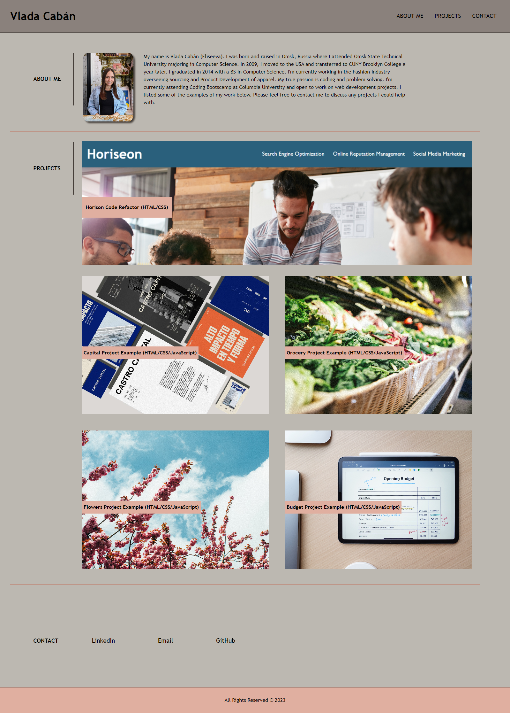
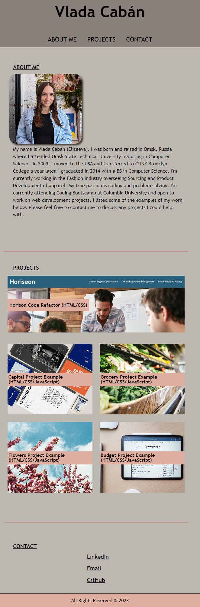

# Portfolio 

## Description

The goal of this project was to create a deployed portfolio webpage that potential employers can view and see information about me, links to my past projects and contact information. When the page is resized, the goal is for the website to adapt to various screens and devices. Screenshots below showcase page layout on mobile devise and regular desktop. 

## Usage

Webpage is located at: https://vlada-caban.github.io/my-portfolio/

Structure and webpage navigation: 

- In the header section of the page, you can see my full name and navigation bar to the different sections of the page.
- When any link from navigation is clicked, there is a smooth scroll to selected section. 
- About me section contains my recent photo and information about my education and experience. 
- Projects section includes images of the projects and name of the project. The feature project is larger in size than the other projects. 
- If clicked on the project image, user is taken to a deployed project webpage. NOTE - only feature project currently has a link to the actual deployed webpage. Other projects are placeholders, and the goal is to replace these with my work as I create more webpages.
- When the user hovers over the project image with the cursor, image opacity changes for interactivity.  
- Contacts section includes links to my Email, LinkedIn and GitHub pages.
- When a page is resized, the layout adapts according to the user's viewport. Different layouts are shown in screenshots below. 

Page layout on desktop devices (width over 768px):

Page layout on mobile devices (width under 768px):

## Credits

- Style sheet that does reset of the default browser styles (reset.css) was taken from Columbia Coding Bootcamp curriculum.
- All images for example porjectes were downloaded from https://unsplash.com/
- Color palette was generated by https://coolors.co/

## License

Please refer to the LICENSE in the repo.
